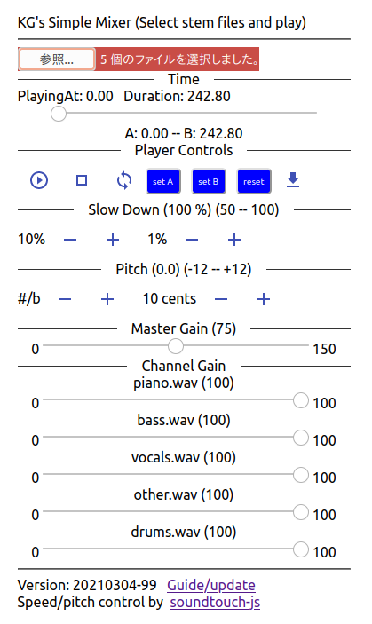
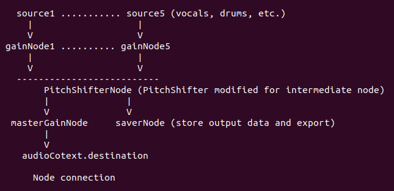

# simple-mixer (experimental since 2021-02-26)

This program mixes stem track files, plays, exports the
result to file;
typically separated with an audio source separation software such as 
[Spleeter](https://github.com/deezer/spleeter/).
Single file can be played, as a matter of course.

Speed/Pitch Control on-the-fly is implemented 
using [soundtouchJS](https://github.com/cutterbl/SoundTouchJS).
AudioWorklet is used if it works on the web browser.

Real-time playback speed is 0 < speed <= 1.0 (sounds choppy if speed > 1.0), 
but is not limited (speed > 0) for export (or playback after processing).

Written with React and Web Audio API.

SoundtouchJS works as an intermediate ScriptProcessorNode 
either with AudioContext or OfflineAudioContext (NG for iOS).
AudioWorklet does not work with OfflineAudioContext.
File export function is implemented in ScriptProcessorNode and
AudioWorkletNode.

## input audio file(s) (wav, mp3, or whatever the browser supports)

Select one or more STEREO audio flle(s) (5stem example)

`
bass.wav, drums.wav, other.wav, piano.wav, vocals.wav
`
## Demo 

[https://goto920.github.io/demos/simple-mixer/](https://goto920.github.io/demos/simple-mixer/)

- AudioWorklet mode can be turned off with the top right smily button
- Recording function (mic icon) has not been implemented yet.




## Addon to soundtouchJS (See [docs/](./docs/) for update and details)

```
npm install soundtouchjs
copy these two files in your project

MyPitchShifter.js
MyFilter.js (extends SimpleFilter)
```

They work as an intermediate ScriptProcessorNode either with AudioContext 
or OfflineAudioContext (NG for iOS).
AudioWorklet does not work with OfflineAudioContext.

### Examples
Currently stereo audio source only.
Arguments for MyPitchShifter() may change (see the source code).

#### For AudioContext (real-time playback)
```
import MyPitchShifter from './MyPitchShifter';

const context = new AudioContext();
const source = context.createBufferSource();
source.buffer = audioBuffer; // audioBuffer is the data to play 
// add same length of silence(zeros) for 50% playback 

const nInputFrames = audioBuffer.length*audioBuffer.sampleRate;
const bufsize = 4096; // 4096 or larger
const recording = false; // true to record the output
const bypass = false; // true to bypass the effect for test 
const shifter = new MyPitchShifter(
       context, nInputFrames, bufsize, recording, bypass);

shifter.tempo = 0.8; 
  // 80% speed (may be changed during playback). Choppy sound if tempo > 1.
const semiTonePitch = 1.0; // one semitone up (#)
shifter.pitch = Math.pow(2.0, semiTonePitch/12.0); 
  // may be changed during playback
const gainNode = context.createGain();
gainNode.gain.value = 0.7;

// shifter.node is the instance of ScriptNodeProcessor in MyPitchShifter
source.connect(shifter.node); 
shifter.node.connect(gainNode);
gainNode.connect(context.destination);
// Other nodes can be connected after shifter.node in case of AudioContext
source.start();

/* set callback functions */
// get the time in MyPitchShifter periodically
shifter.onUpdateInterval = 1.0; // in second
shifter.onUpdate = function(playingAt) { 
  console.log('Playing At', shifter.playingAt);
  // or console.log('Playing At', playingAt);
  // now time is returnd in the function arg 
}

// When there is no more output
shifter.onEnd = function(audioBuffer) { 
  source.disconnect();
  if (recording) {
  // export the processed audio
  // shifter.exportToFile('mix_' + Date.now() + '.wav'); 
  // and /or play the processed audio //
  /*
     source2 = context.createBufferSource(); 
     source2.buffer = shifter.recordedBuffer;
     // = audioBuffer; also works now
     source2.connect(context.destination);
     source2.start();
  */
  }

}

// When source is stopped with GUI (stop button etc.)
source.onended = function(e) {
  shifter.stop(); // onEnded() will be called
}

```

#### For OfflineAudioContext (does not work on iOS devices)
Surprisingly this worked on macOS Safari and Chrome.

```
import MyPitchShifter from './MyPitchShifter';

let tempo = 1.5; 
const channels = 2;
const nInputFrames = audioBuffer.length*audioBuffer.sampleRate;
const nOutputFrames = Math.max(nInputFrames, nInputFrames/tempo);
context = new OfflineAudioContext (
    channels, nOutputFrames + 1.0*sampleRate, sampleRate);
// nOutputFrames is the expected length in frames (add 1 sec)
// Double the length of input audio for 50% playback

const bufsize = 4096; // 4096 or larger
const recording = true; 
const bypass = false; // true to bypass the effect for test 
const shifter = new MyPitchShifter(
       context, nInputFrames, bufsize, recording, bypass);
shifter.tempo = tempo; // Better not change during processing 
const semiTonePitch = -1.0; // one semitone down (b)
shifter.pitch = Math.pow(2.0, semiTonePitch/12.0); 
// Better not change during processing 

const source = context.createBufferSource();
source.buffer = audioBuffer; // audioBuffer is the data to play 
source.connect(shifter.node); 
shifter.node.connect(context.destination);
/* Note: shifter.node is the last node for OfflineAudioContext. 
   The output audio samples of ScriptProcessorNode 
   are collapsed (almost zero) in case of OfflineAudioContext
*/
source.start(); 

context.startRendering();

/* If you want to check how many seconds have been processed */
// shifter.onUpdateInterval = 10.0; 
// shifter.onUpdate = function() { console.log(shifter.playingAt); }

/* onEnd called when processing is over */
shifter.onEnd = function () {
  source.disconnect();
  shifter.exportToFile('mix_' + Date.now() + '.wav');
  /* And/or play shifter.recordedBuffer */
}

/* If you want interrupt the processing 
   Processing time is just a few seconds for five minutes song */
// source.onended = function (e) { 
//   shifter.stop(); 
// }


/* e.renderedBuffer 
  should be the processed samples but actually it is collapsed.
*/
// context.oncomplete = function(e) {
//  console.log( 'Offline render complete length = ', e.renderedBuffer.length);
// }

```

### Issues/Plan/Status
- Realtime playback -- Slow down only (50 -- 100%) (Spec)
- (Mar. 11) Voice recording with playback ==> Will think of this after other issues
- (Mar. 11) Performance issues ==> Reduce UI rendering ==> testing
- (Mar. 15) Working on docs
